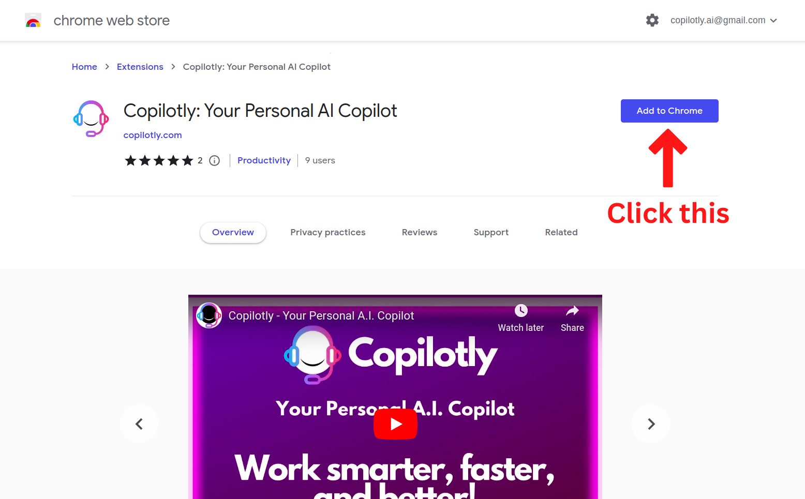
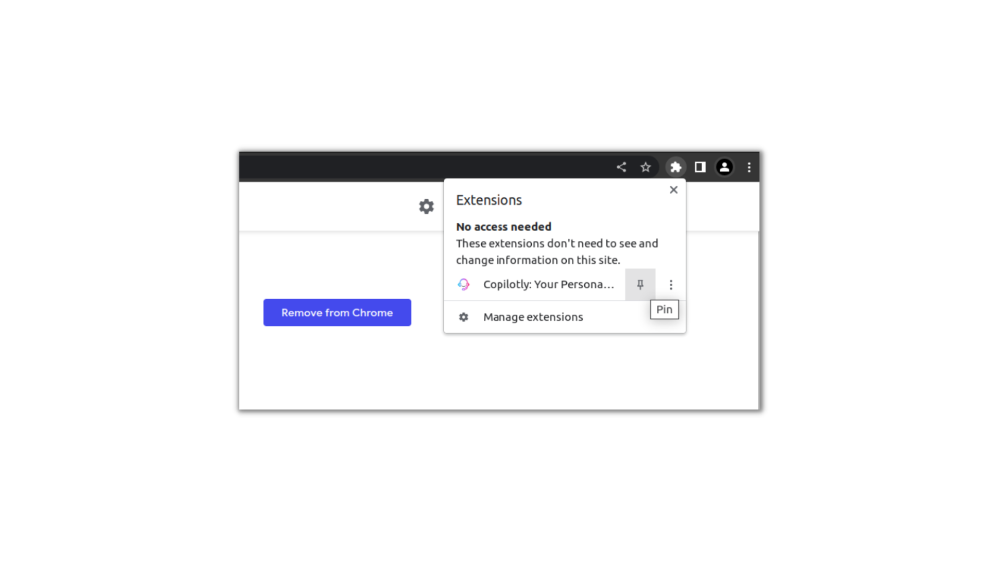

# Chrome

Visit the [Chrome Web Store](https://chrome.google.com/webstore/detail/copilotly-your-personal-a/fnpfnkfggchkcaheehdgmdapnomokajo?hl=en&authuser=1) to install Copilotly for Chrome.

## Installation

Installing Copilotly for Chrome Browser is easy and requires just a couple steps.

### Step 1: Find Copilotly Extension in Chrome Web Store

- Navigate to [Copilotly Extension](https://chrome.google.com/webstore/detail/copilotly-your-personal-a/fnpfnkfggchkcaheehdgmdapnomokajo?hl=en&authuser=1).

- Click on the **Add To Chrome** button as shown below.

- For faster access, **click on the pin icon** to keep the Copilotly extension on your toolbar.

### Step 2: Create Copilotly Account

Once you have installed the Copilotly extension, you will be prompted to create a Copilotly account. You can also create an account by visiting <https://app.copilotly.com>.

Contact Support if you have any questions or need help.
