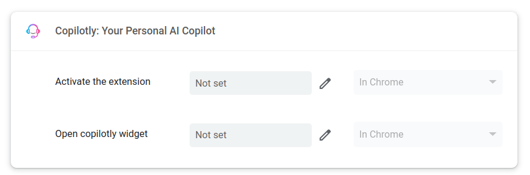

# Change Shortcut Key

1. Go to `chrome://extensions/shortcuts` in your browser.

**NOTE**: (Even on Brave, Opera, or Edge, you can use the `chrome://extensions/shortcuts` URL.)

2. Scroll down to the "Copilotly" extension and click on the "Keyboard shortcuts" button.

3. Set the shortcut key you want to use for Copilotly.

