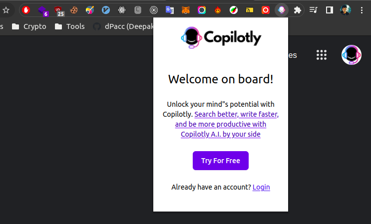
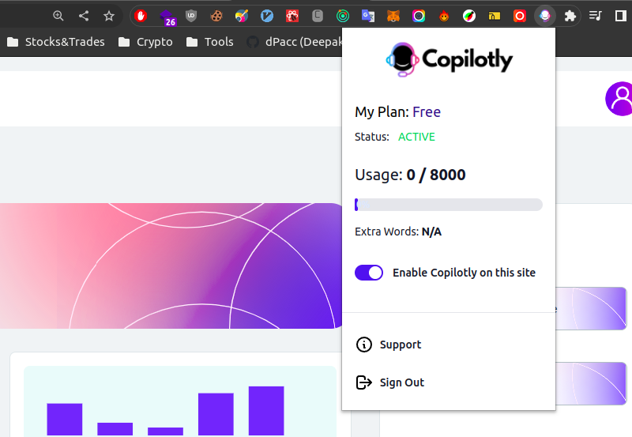

# Check Login

After creating an account, check if you are logged in to Copilotly extension.

- Click on the Copilotly extension icon to check if you are logged in. If you are not logged in, you will be prompted to log in.

- After logging in, you will see the below image, you are logged in and ready to use Copilotly!

