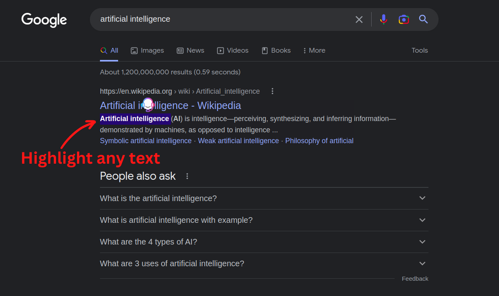
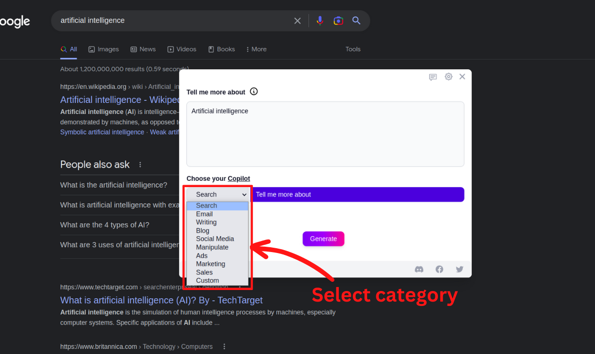
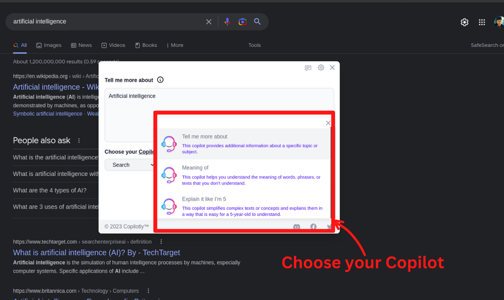
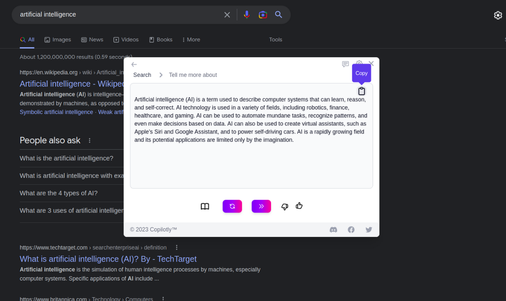
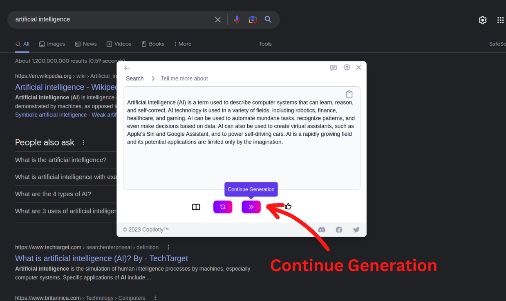
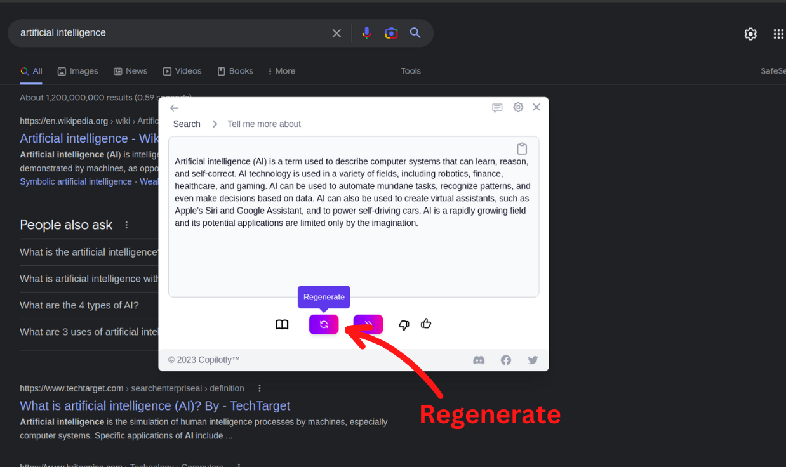

# Using Copilotly

So, how does Copilotly work? It’s pretty easy and straightforward. All you need to do is highlight text on any website and an icon will appear at the top of the selected text. Then, clicking on this icon will open up a widget where your selected text will be present in a text box. From here, you can select the category and copilot of your choice to generate the text.

## Step 1: Highlight Text

The first step is to highlight the text you want to generate. You can highlight any text on any website. You can also highlight multiple paragraphs of text.

## Step 2: Click on the Copilotly Icon

Once you have highlighted the text, a Copilotly icon will appear at the top of the highlighted text. Click on this icon to open up the Copilotly widget.

## Step 3: Choose Category

The Copilotly widget will open up with the highlighted text in a text box. You can choose the category of the text you want to generate.

## Step 4: Select the Copilot

Once you have selected the category, you can select the copilot of your choice. Copilotly has a wide range of copilots to choose from. You can select the copilot based on their writing style, personality, and other factors.

## Step 5: Generate

Once you have selected the category and copilot, you can click on the “Generate” button to generate the text. The generated text will appear in the text box. You can copy the text and paste it wherever you want.

## Additional Features

## Step 7A: Continue Generation

If you want to continue generating text, you can click on the “Continue Generation” button. This will generate more text based on the same category and copilot.

## Step 7B: Regenerate

If you want to regenerate the text, you can click on the “Regenerate” button. This will generate a new text based on the same category and copilot.

## Step 8: Voila! You’re Done

That’s it! You have successfully generated the text. You can now copy the text and paste it wherever you want. You can also generate more text by repeating the steps.
